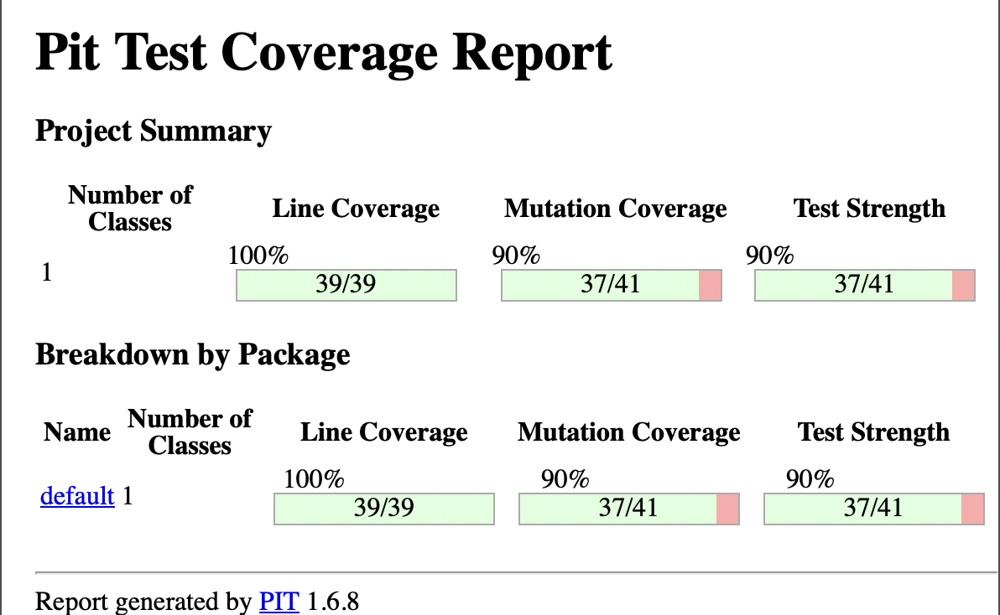
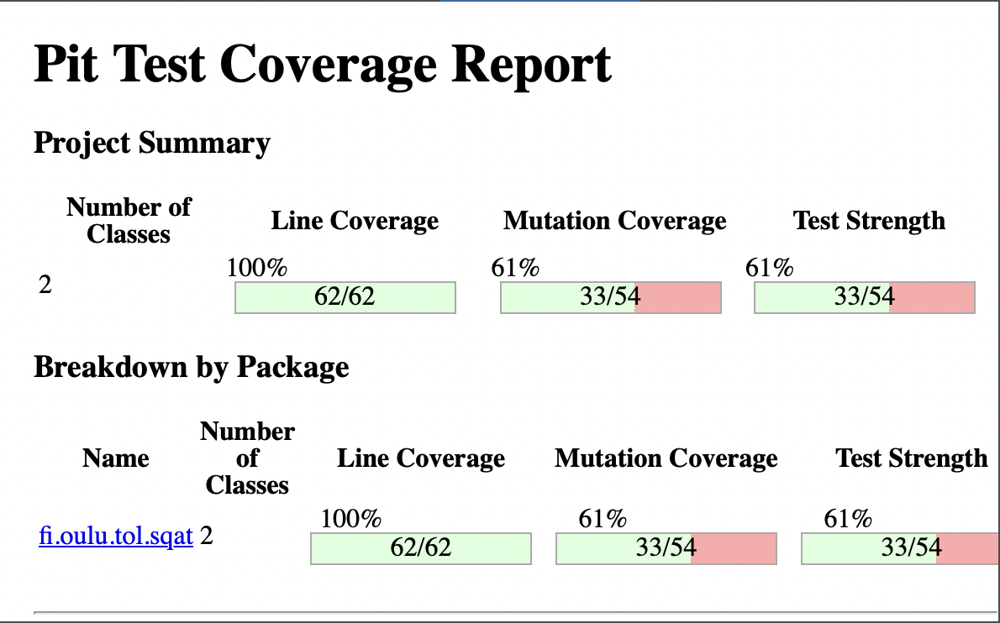

# Software Quality and Testing Course 2023

## Introduction
In the "Software Quality and Testing Course 2023", I got my first touch with JUnit & PIT Mutation Testing. This course has been instrumental in enhancing my understanding of JUnit testing. Now, I can confidently write tests and understand the nuances of assertion testing.

## Key Learnings
- **JUnit Testing**: Gained hands-on experience in writing and executing unit tests using JUnit, understanding its importance in the development cycle.
- **Assertion Testing**: Learned how to effectively use assertions to validate the code behavior against expected outcomes.
- **PIT Mutation Testing**: Explored PIT Mutation Testing to evaluate the effectiveness and quality of the written tests.

## Course Projects

### TennisGame Testing
In this module, we focused on testing a Tennis Game application. The objective was to cover various game scenarios and ensure the correctness of the game's logic.

- **PIT Mutation Testing for TennisGame**
  
  

- **Test Coverage for TennisGame**
  
  

### GildedRose Testing 
The GildedRose project was particularly challenging, involving complex logic and multiple test cases. Through this, I learned to handle intricate testing scenarios.

- **PIT Mutation Testing for GildedRose**
  
  

- **Test Coverage for GildedRose**
  
  

## Conclusion
This course has been a comprehensive journey into the world of software quality and testing. I've not only learned about testing tools and techniques but also about their critical role in building reliable and robust software.

---

*Looking forward to applying these skills in real-world software development scenarios!*
